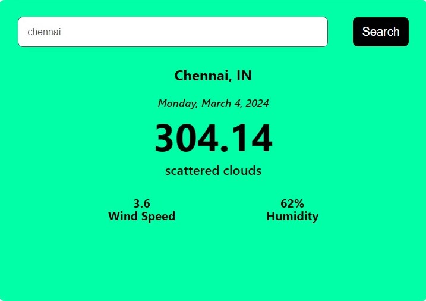

### ReactJs Weather App

- Welcome to the Weather App project! This simple yet effective application provides users with up-to-date weather details for a specified city, including current temperature, humidity, and wind speed. Utilizing a weather API to fetch real-time data, this app leverages JavaScript handlers to display the information in a clear and user-friendly manner.

## Features

- Current Weather: Obtain the latest weather information for any city worldwide.
- Temperature: View the current temperature in Celsius or Fahrenheit.
- Humidity: Check the humidity level to plan your day accordingly.
- Wind Speed: Stay informed about the wind speed in your area.

## Usage

- Enter the name of the desired city in the search bar.
- Press the search button or hit Enter.
- Instantly access the current weather details for the specified city.

## Technologies Used

- ReactJs- Used for building the user interface and handling user interactions.
- JavaScript: Used for handling user interactions and displaying weather data.
- Weather API: Integrated to fetch real-time weather information.
- HTML/CSS: Provides the structure and styling for the application
  
